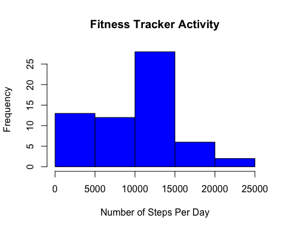
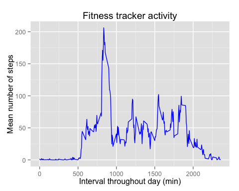
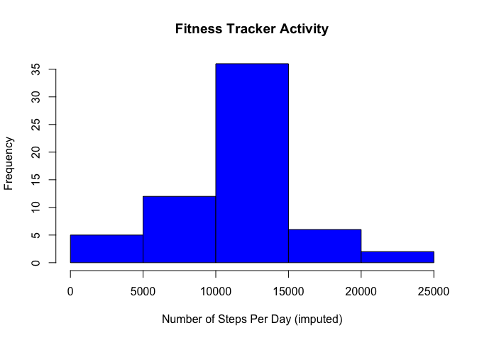
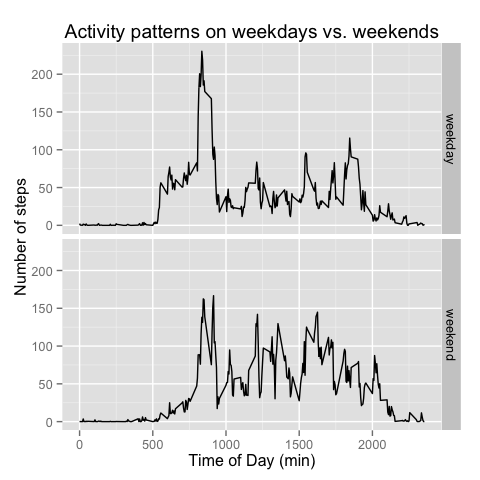
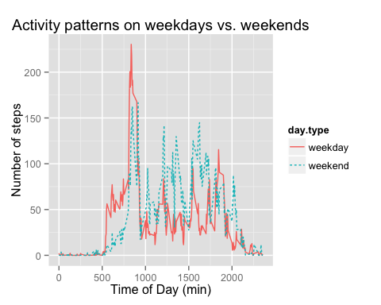

# Reproducible Research: Peer Assessment 1

## Libraries
Start by loading some of the libraries that will be used and
setting the knitr options.  Note that, contrary to what the instructions
claim, the figures are not saved by default, so this has to be set.

```r
library(knitr, quiet=T)
library(plyr, quiet=T)  # For munging
library(ggplot2, quiet=T)  # For plotting
opts_chunk$set(dev="png", fig.path="figure/")
```

## Loading and preprocessing the data

Load the data.  Store the data both as a factor and as a POSIX date: 

```r
if (!file.exists("activity.csv")) stop("activity.csv not present")
activity <- read.csv("activity.csv", header=TRUE, 
                     colClasses=c("numeric", "character", "numeric"),
                     stringsAsFactors=FALSE)
activity$date.factor <- as.factor(activity$date)
activity$date <- as.Date(activity$date, format="%Y-%m-%d")
```


## What is mean total number of steps taken per day?

Now make a histogram of the number of steps per day.  Here
we will ignore any missing values.


```r
activity.daily <- ddply(activity, .(date.factor), summarize,
                        total.steps=sum(steps, na.rm=TRUE))
hist(activity.daily$total.steps, col="blue", main="Fitness Tracker Activity",
     xlab="Number of Steps Per Day")
```

 

The mean and median per interval are:

```r
mn <- mean(activity$steps, na.rm=TRUE)
md <- median(activity$steps, na.rm=TRUE)
cat(paste("The mean number of steps per interval is", 
          format(mn, digits=4), "and the median is", 
          format(md, digits=2), "(ignoring missing values)"))
```

```
## The mean number of steps per interval is 37.38 and the median is 0 (ignoring missing values)
```

And per day (which is the question from the assignment)

```r
mn <- mean(activity.daily$total.steps, na.rm=TRUE)
md <- median(activity.daily$total.steps, na.rm=TRUE)
cat(paste("The mean number of steps per day is", 
          format(mn, digits=4), "and the median is", 
          format(md, digits=2), "(ignoring missing values"))
```

```
## The mean number of steps per day is 9354 and the median is 10395 (ignoring missing values
```

## What is the average daily activity pattern?

Here we will take advantage of the fact that the interval variable
*wraps* at the end of each day.  Again, we are ignoring NA values.


```r
activity.pattern <- ddply(activity, "interval", summarize,
                          mean=mean(steps, na.rm=TRUE))
g <- ggplot(activity.pattern, aes(interval, mean))
g + geom_line(color="blue") + 
  labs(title="Fitness tracker activity", 
       x="Interval throughout day (min)",
       y="Mean number of steps")
```

 

What interval has the highest average number of steps?

```r
max.interval <- activity.pattern$interval[which.max(activity.pattern$mean)]
cat(paste("Interval corresponding to maximum average number of steps:",
          max.interval,"minutes"))
```

```
## Interval corresponding to maximum average number of steps: 835 minutes
```

## Imputing missing values

How many rows have missing values?  Note that this is not the
same as the number of missing elements if there are more
than two NAs in a row.

```r
nmissing <- sum(!complete.cases(activity))
cat(paste("Number of rows with missing data:", nmissing))
```

```
## Number of rows with missing data: 2304
```

We fill missing values for the number of steps with the mean number 
for that interval.   Note that this will make the steps non-integral.


```r
impute.value <- function(steps, interval) {
    if (is.na(steps)) {
        activity.pattern[activity.pattern$interval==interval,]$mean
    } else {
        steps
    }
}
imputed.activity <- activity
imputed.activity$steps <- mapply(impute.value, activity$steps, 
                                activity$interval)
```

Now see how different the mean and median are for the total
number per day with and without imputation:

```r
total.steps <- tapply(activity$steps, activity$date.factor,
                      sum, na.rm=TRUE)
total.steps.imputed <- tapply(imputed.activity$steps,
                              imputed.activity$date.factor, sum)
cat(paste("For the raw data the mean and median per day are:",
          format(mean(total.steps)), "and", median(total.steps)))
```

```
## For the raw data the mean and median per day are: 9354.23 and 10395
```

```r
cat(paste("For the imputed the mean and median per day are:",
          format(mean(total.steps.imputed)), "and", 
          format(median(total.steps.imputed))))
```

```
## For the imputed the mean and median per day are: 10766.19 and 10766.19
```
In this case imputation increases both the mean and median.  Note that they
are not exactly equal after imputation if more digits are shown, but are 
quite close.  Imputing using the median would have a very different 
effect, and would lower the mean.

Make a histogram of the mean number per day after imputation.

```r
hist(total.steps.imputed, col="blue", main="Fitness Tracker Activity",
     xlab="Number of Steps Per Day (imputed)")
```

 

Check to make sure we filled in all the missing values:

```r
nmissing <- sum(!complete.cases(imputed.activity))
cat(paste("After imputation, number of rows with missing data:", nmissing))
```

```
## After imputation, number of rows with missing data: 0
```

## Are there differences in activity patterns between weekdays and weekends?

Add a factor variable for weekday vs. weekend:

```r
daytype <- function(date) 
    if (weekdays(date) %in% c("Saturday", "Sunday")) "weekend" else "weekday"
imputed.activity$day.type <- as.factor(sapply(imputed.activity$date, daytype))
```

And look at the mean number of steps per day per date type:

```r
steps.day.daytype <- ddply(imputed.activity, .(interval, day.type),
                           summarize, steps=mean(steps))
ggplot(steps.day.daytype, aes(interval, steps)) + 
    geom_line() + facet_grid(day.type ~ .) +
    labs(x="Time of Day (min)", y="Number of steps",
         title="Activity patterns on weekdays vs. weekends")
```

 

It's a bit nicer to overplot them, although that isn't
strictly part of the assignment.

```r
ggplot(steps.day.daytype, aes(interval, steps)) + 
    geom_line(aes(color=day.type, linetype=day.type)) +
    labs(x="Time of Day (min)", y="Number of steps",
         title="Activity patterns on weekdays vs. weekends")
```

 
